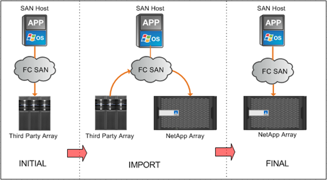

= Información general sobre importación de LUN externa
:allow-uri-read: 
:icons: font
:imagesdir: ../media/

[role="lead"]
Foreign LUN Import (FLI) es una función integrada en ONTAP que permite a los usuarios importar datos de LUN de cabina externas a LUN de NetApp de una forma sencilla y eficiente.

Todas las migraciones FLI se efectúan a nivel de LUN. FLI es una herramienta que se basa estrictamente en bloques; las migraciones basadas en archivos, registros, NFS y CIFS no son compatibles. Para consultar otras metodologías de migración para los protocolos de nivel de archivo, como NFS y CIFS/SMB, revise la https://library.netapp.com/ecm/ecm_get_file/ECMP12363719["Referencia rápida de herramientas de migración de datos"].

FLI aprovecha la tecnología FlexArray® de NetApp para descubrir las LUN externas de cabinas RAID y extraer datos de ellas. FlexArray permite que una controladora ONTAP de NetApp actúe como iniciador frente a una o varias cabinas de terceros. FlexArray puede montar las LUN de dichas cabinas como almacenamiento de entorno administrativo y, a continuación, presentar el espacio de dichas LUN como almacenamiento unificado de NetApp (lo que permite el acceso a los protocolos FCP, FCoE, iSCSI, NFS y CIFS/SMB) a los hosts de su entorno SAN o NAS.

FLI no requiere una licencia de FlexArray. FLI aprovecha la tecnología de FlexArray para copiar la LUN externa en una cabina de ONTAP de NetApp y, después, permite que los hosts y aplicaciones que consumen esa LUN señalen la cabina de NetApp que ahora aloja la LUN en cuestión. Aunque ONTAP ya no requiere una migración dirigida a los servicios profesionales, NetApp recomienda encarecidamente que participen en el ámbito de la planificación, la formación y el dimensionamiento para todas las migraciones, excepto para las más sencillas.

FLI se desarrolló para migrar LUN DE SAN a ONTAP. FLI admite una serie de requisitos de migración, incluidos, entre otros, los siguientes:

* Migrar datos entre cabinas de almacenamiento heterogéneas de EMC, Hitachi, HP y otros proveedores a NetApp según lo admita la configuración de FlexArray.
* Simplificar y acelerar las migraciones de datos en bloques durante la reubicación, la consolidación y las sustituciones de cabinas del centro de datos.
* Consolidar la migración y la realineación de LUN en un único flujo de trabajo.

Además, el procedimiento de transición de 7-Mode a ONTAP puede convertir agregados de 32 bits a agregados de 64 bits, solucionar problemas de alineación y migrar LUN como una única operación.

FLI permite que el almacenamiento de NetApp detecte las LUN que es necesario importar para la migración de datos. Los LUN externos se muestran como discos en el sistema de almacenamiento de NetApp y no tienen asignada la propiedad automáticamente para que los datos de usuario no se sobrescriben por error. Los discos que contienen LUN de cabina externos deben marcarse como externos. Las reglas para configurar LUN de cabina externas deben respetarse estrictamente para poder usar FLI para el almacenamiento de NetApp. Consulte el tema, xref:concept_lun_requirements_and_limitations.adoc[Requisitos y limitaciones de LUN].

FLI requiere al menos un puerto FC físico en cada controlador y que los LUN migren directamente en modo iniciador. Se prefieren dos puertos, uno para cada estructura, pero se puede usar un solo puerto. Estos puertos se utilizan para conectar con la matriz de origen y deben estar zonificados y enmascarados para poder ver y montar los LUN de origen. Si necesita cambiar un puerto de destino a iniciador, consulte link:https://docs.netapp.com/us-en/ontap/san-admin/configure-fc-adapters-task.html["Configurar adaptadores FC"^] .

Las migraciones FLI pueden realizarse sin conexión, lo que interrumpe las operaciones durante la importación o en línea, lo que normalmente no es disruptivo.

En esta figura, se muestra una migración de datos sin conexión FLI, donde el host se desconecta para la migración. La cabina de NetApp copia los datos directamente desde la cabina de terceros.

image::../media/foreign_lun_import_overview_1.png[Información general sobre la migración de datos FLI]

Esta figura muestra la migración de datos en línea FLI. El host está conectado a la controladora de NetApp donde ahora se aloja el nuevo LUN. La operación de host puede reanudarse y continuar durante la importación.

