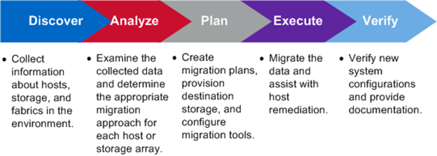

= Descripción general del proceso de migración
:allow-uri-read: 
:icons: font
:imagesdir: ../media/

[role="lead"]
El proceso de migración FLI es una metodología de cinco fases que se aplica a cualquier migración de datos: Detección, análisis, planificación, ejecución y verificación.

Estas fases proporcionan un marco general que ayuda a identificar dónde se realizan las tareas más comunes a lo largo del proceso de migración. Los gráficos de esta sección muestran las tareas que se pueden realizar en paralelo en cada uno de los cuatro componentes principales: Host, estructura, almacenamiento de destino y almacenamiento de origen.
