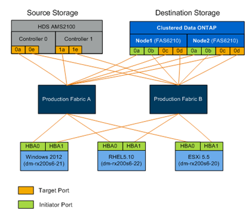

= Mejores prácticas de cableado para la migración FLI
:allow-uri-read: 
:icons: font
:imagesdir: ../media/

[role="lead"]
Para configurar el almacenamiento de ONTAP para la migración FLI, debe llevar el almacenamiento de origen a la estructura en función de la información de planificación y las prácticas recomendadas.

Al configurar el almacenamiento de ONTAP para la migración FLI, se recomiendan las siguientes prácticas recomendadas para el cableado.

* Utilice estructuras dobles para redundancia.
* Use al menos dos iniciadores y dos puertos de destino en cada almacenamiento de destino para la migración FLI.
* No dividir los puertos de iniciador de almacenamiento de destino en zonas con el host. Los puertos de iniciador de ONTAP se utilizan para dividir la zona con los puertos de destino del almacenamiento de origen.

A continuación se muestra un ejemplo de cableado para almacenamiento de origen y destino en una estructura de producción.

