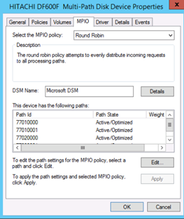

= Verificación multivía para hosts Windows
:allow-uri-read: 
:icons: font
:imagesdir: ../media/

[role="lead"]
Como parte del proceso de importación de LUN externa (FLI), debe verificar que la multivía está configurada y funciona correctamente en los hosts.

Complete los siguientes pasos para hosts Windows.

.Pasos
. Administración de discos abiertos.
+
.. En el escritorio de Windows, haga clic en *Inicio*.
.. En el campo Iniciar búsqueda, escriba `diskmgmt.msc`.
.. En la lista programas, haga clic en `diskmgmt`.

. Haga clic con el botón secundario en cada disco para el que desee verificar las rutas múltiples y, a continuación, haga clic en *Propiedades*.
. En la pestaña MPIO, en la lista Select the MPIO policy, haga clic en todas las rutas activas.
+

+
Para verificar la multiruta mediante la línea de comandos, lleve a cabo los siguientes pasos:

. Abra el símbolo del sistema de Windows.
. Ejecute mpclaim.exe --v c:\multipathconfig.txt para capturar la configuración multivía.

