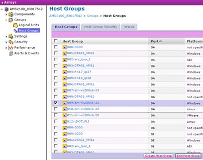

= Eliminación de las LUN de origen de los hosts
:allow-uri-read: 
:icons: font
:imagesdir: ../media/

[role="lead"]
Los siguientes pasos describen cómo eliminar las LUN de origen del host una vez completada la migración FLI.

NOTE: Esta tarea utiliza una matriz _HDS AMS2100_ en los ejemplos. Las tareas pueden ser diferentes si se utiliza una matriz diferente o una versión diferente de la GUI de matriz.

Para quitar las LUN de origen del host, siga los pasos siguientes:

.Pasos
. Inicie sesión en Hitachi Storage Navigator Modular.
. Seleccione el host que se migra y seleccione *Editar grupo de hosts*.
+

. Seleccione *puertos* y seleccione *conjunto forzado* para todos los puertos seleccionados.
+
image::../media/remove_source_luns_from_host_2.png[elimine las lun de origen del host 2]

. Seleccione los LUN de host que se migran desde los LUN lógicos asignados. Utilice los nombres de LUN para cada host mencionado en la hoja de cálculo de las LUN de origen. Aquí, seleccione LUN del host de Windows 2012 y seleccione *Quitar*.
+

. Repita los pasos para hosts ESX de Linux y VMware.

