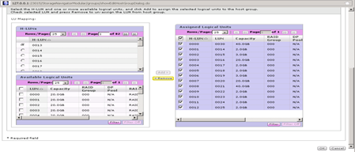

= Eliminar las LUN de origen del almacenamiento de ONTAP
:allow-uri-read: 
:icons: font
:imagesdir: ../media/

[role="lead"]
Los siguientes pasos describen cómo quitar las LUN de origen del almacenamiento ONTAP una vez completada la migración.

NOTE: Esta tarea utiliza una matriz _HDS AMS2100_ en los ejemplos. Las tareas pueden ser diferentes si se utiliza una matriz diferente o una versión diferente de la GUI de matriz.

.Pasos
. Inicie sesión en Hitachi Storage Navigator Modular.
. Seleccione el grupo de host ONTAP creado durante la fase del plan y seleccione *Editar grupo de hosts*.
+
image::../media/remove_source_luns_from_ontap_storage_1.png[Grupos de hosts]

. Seleccione *puertos* y seleccione *conjunto forzado* para todos los puertos seleccionados.
+
image::../media/remove_source_luns_from_ontap_storage_2.png[Editar grupos de hosts]

. Seleccione los LUN de host que se migran desde los LUN lógicos asignados. Utilice los nombres de LUN para cada host mencionado en la hoja de cálculo de las LUN de origen. Aquí, seleccione LUNs of Windows 2012, RHEL 5.10 y ESXi 5.5 hosts y, a continuación, seleccione *Remove*.
+

